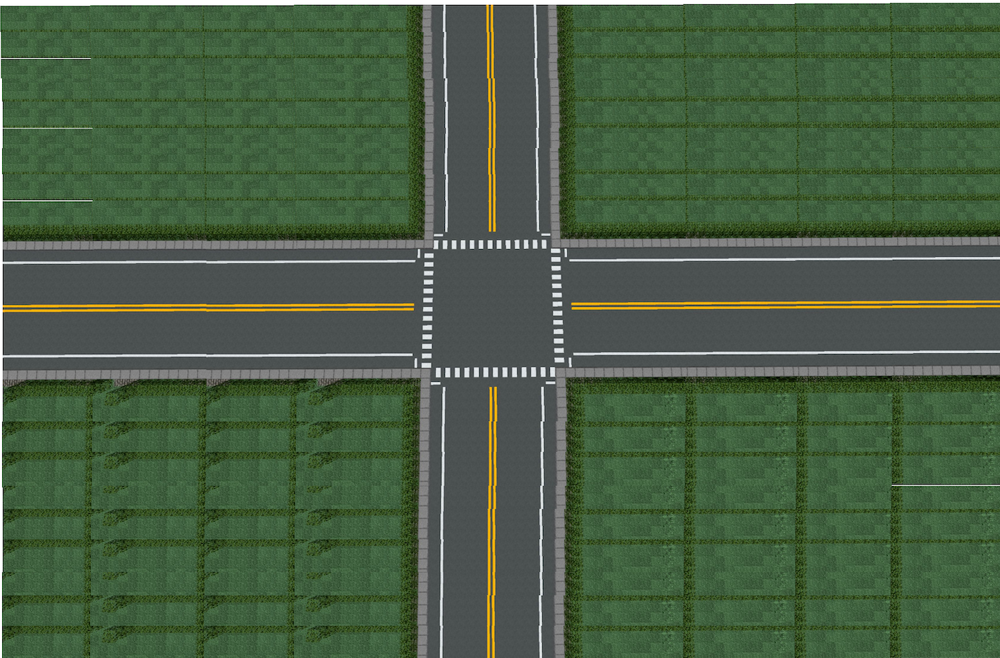

# 🚦 Smart Traffic Signal Simulator

A Python-based 4-way traffic intersection simulator that models realistic vehicle flow, adaptive signal control, and dynamic turning behavior using `pygame`. Designed for intelligent traffic management using real-time vehicle density and type-based signal adjustments.

---

## 🛠️ Features

- 🔄 **4-Way Intersection Simulation**  
  Simulates traffic across four directions with up to 3 lanes each.

- 🚗 **Vehicle Diversity**  
  Includes cars, bikes, buses, trucks, and rickshaws.

- 🔀 **Turn Logic**  
  Randomized vehicle turning based on lane and direction.

- ⏱️ **Adaptive Signal Timing**  
  Dynamic green light duration based on real-time vehicle count and vehicle type priority.

- 🧵 **Multithreaded Architecture**  
  Handles signal control, vehicle generation, and simulation timer in parallel.

- 📊 **Live Traffic Stats**  
  Displays throughput, lane-wise count, and overall vehicles per second.

---

## 📸 Screenshot

<p align="center">
  
</p>

---

## 🧑‍💻 Technologies Used

- **Python 3.x** – Core simulation logic  
- **Pygame** – GUI, vehicle rendering, and signal control  
- **Multithreading** – Concurrent simulation execution  
- **OOP (Object-Oriented Programming)** – Modeling vehicles and signals

---

## 📁 Project Structure

```
.
├── images/
│   ├── down/             # Vehicles facing downward
│   ├── left/             # Vehicles facing left
│   ├── right/            # Vehicles facing right
│   ├── up/               # Vehicles facing upward
│   ├── signals/          # Traffic signal images
│   ├── car1.png          # Sample vehicle
│   ├── car2.jpg
│   ├── intersection.jpg  # Base intersection layout
│   └── mod_int.png       # Modified intersection image
├── simulation.py         # Main simulation script
├── README.md             # Project documentation
```

---

## ▶️ Getting Started

### 1. Clone the Repository

```bash
git clone https://github.com/yourusername/traffic-signal-simulator.git
cd traffic-signal-simulator
```

### 2. Install Dependencies

```bash
pip install pygame
```

### 3. Run the Simulator

```bash
python simulation.py
```
## ⚙️ Configuration Options

You can tweak the following parameters inside `simulation.py`:

| Parameter            | Description                               |
|----------------------|-------------------------------------------|
| `simTime`            | Total duration of simulation (seconds)    |
| `defaultGreen`       | Default green signal duration (seconds)   |
| `defaultRed`         | Default red signal duration (seconds)     |
| `defaultYellow`      | Yellow signal duration                    |
| `noOfLanes`          | Number of lanes per direction             |
| `generateVehicles()` | Configure vehicle spawn rates and speeds  |

---

## 📈 Sample Output

```bash
GREEN TS 1 -> r: 0  y: 5  g: 20
RED   TS 2 -> r: 25 y: 5  g: 20
RED   TS 3 -> r: 55 y: 5  g: 20
RED   TS 4 -> r: 85 y: 5  g: 20

Total vehicles passed: 310
Vehicles per second: 1.03
```

---

## ✅ Future Enhancements

- [ ] Integrate real-time vehicle detection via YOLO (placeholder exists in code)
- [ ] Add GUI-based configuration panel
- [ ] Export simulation stats to CSV for analysis
- [ ] Save simulation as video/GIF for visualization


---

## 🙋‍♂️ Author

**Sanskar Jain**  
📧 [sanskarjain3112@gmail.com](mailto:sanskarjain3112@gmail.com)  
